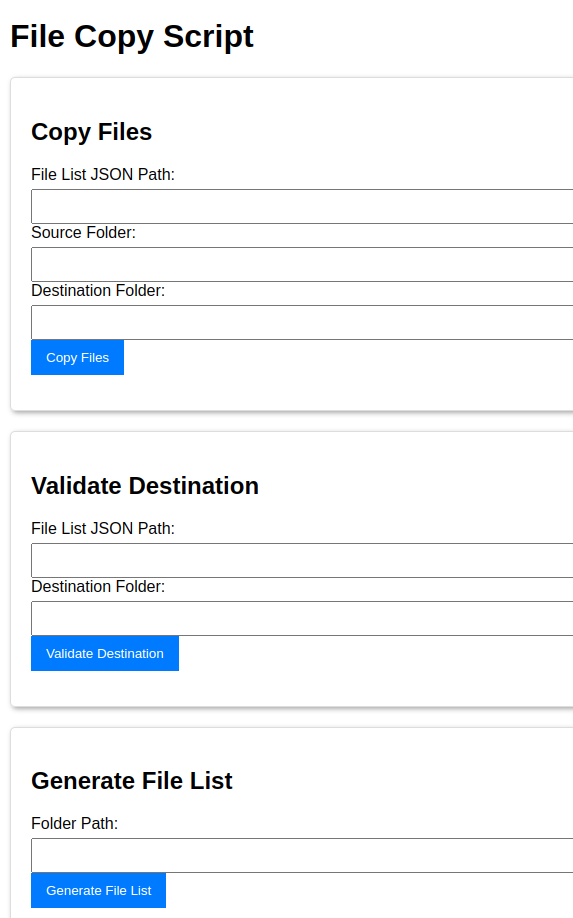

# File Copy Script

This project provides a web-based graphical user interface (GUI) using FastAPI to manage the copying of files from a source folder to a destination folder based on a list provided in a JSON file. It includes functionalities for managing file updates, tags, validating the destination folder, and generating a file list JSON.

## Features

- **Select File List**: Choose a JSON file containing the list of files to be copied or enter a new path.
- **Select Source Folder**: Choose the folder where the source files are located or enter a new path.
- **Select Destination Folder**: Choose the folder where the files will be copied or enter a new path.
- **Manage File Updates**: Open and edit the JSON file for file updates.
- **Manage Tags**: Open and edit the JSON file for tags.
- **Copy Files**: Copy files from the source folder to the destination folder based on the list.
- **Validate Destination**: Validate that all files listed in the JSON file are present in the destination folder.
- **Generate File List**: Generate a `file_list.json` file for a given folder path.
- **History**: Keep track of the last 10 selections for each text field.

## Prerequisites

- Python 3.x
- FastAPI
- `uvicorn`

## Installation

1. Clone the repository:

    ```bash
    git clone https://github.com/yourusername/file-copy-script.git
    cd file-copy-script
    ```

2. (Optional) Create and activate a virtual environment:

    ```bash
    python -m venv venv
    source venv/bin/activate  # On Windows use `venv\Scripts\activate`
    ```

3. Install the dependencies:

    ```bash
    pip install fastapi uvicorn jinja2
    ```

## Running the Application

1. Run the FastAPI application using the provided entry point script:

    ```bash
    python run.py
    ```

2. Open your browser and go to `http://127.0.0.1:8000` to see the application.

## Packaging the Application into an Executable

To package the application into a single executable file without the need to install Python or Python libraries on the target computer, use PyInstaller:

1. Install PyInstaller:

    ```bash
    pip install pyinstaller
    ```

2. Create the executable using the provided spec file:

    ```bash
    pyinstaller run.spec -y
    ```

3. The executable will be generated in the `dist/run` directory. You can run it using:

    ```bash
    cd dist/run
    ./run.exe
    ```

## User Interface

### Main Window

The main window allows you to select the file list, source folder, and destination folder. It also provides options to manage file updates and tags, copy files, validate the destination, and generate a file list.



### File List Selection

Select the JSON file that contains the list of files to be copied or enter a new path.


### Source Folder Selection

Select the folder where the source files are located or enter a new path.


### Destination Folder Selection

Select the folder where the files will be copied or enter a new path.


### Manage File Updates

Open the JSON file for file updates in the default text editor.


### Manage Tags

Open the JSON file for tags in the default text editor.


### Copy Files

Copy the files from the source folder to the destination folder based on the list provided in the JSON file. The application will show a message with the number of files copied.


### Validate Destination

Validate that all files listed in the JSON file are present in the destination folder. The application will show a message indicating if any files are missing.


### Generate File List

Generate a `file_list.json` file for a given folder path. The application will show a message indicating where the file list was saved.


## JSON File Formats

### File List JSON

The file list JSON should contain an array of files with their filenames, descriptions, and tags.

```json
{
    "files": [
        {
            "filename": "example1.txt",
            "description": "Text file with example data",
            "tags": ["text", "example", "data"]
        },
        {
            "filename": "example2.docx",
            "description": "Word document with project details",
            "tags": ["word", "document", "project"]
        }
    ]
}
